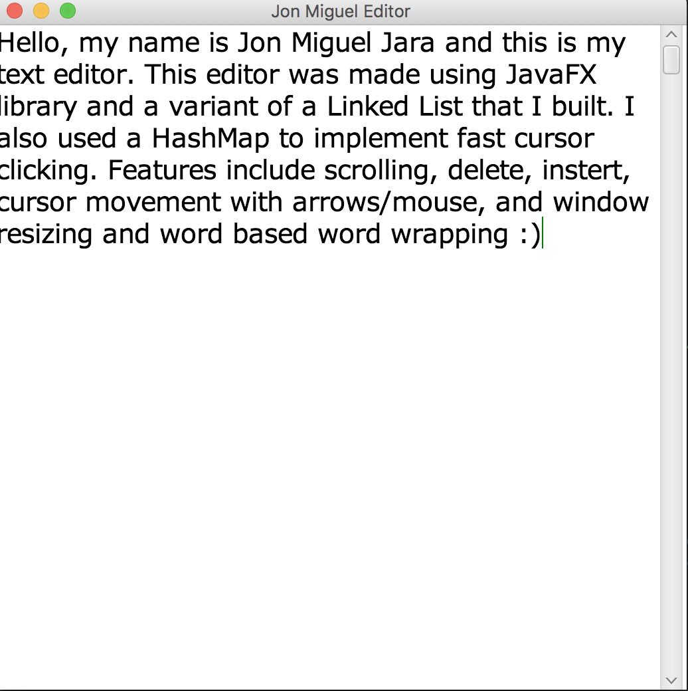
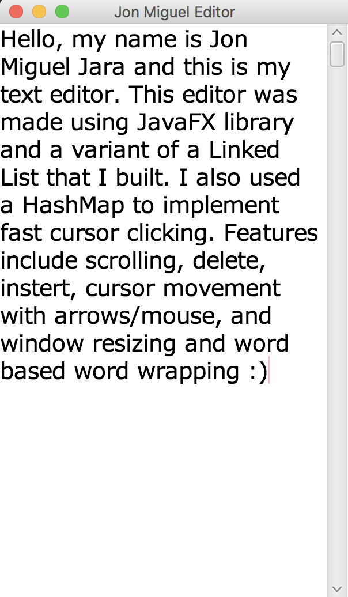

## Name of Application
   Java Editor
## Project Owner
   Jon Miguel Jara
## Purpose
   Simple JavaFX based text editing with basic functionality

## Features
	* Keyboard Event listeners read output for keys and render characters on JavaFX scene
	* Word based word wrapping
	* Constant time cursor movement with arrow keys and mouse clicks
	* Scroll Bar
	* Window resizes with text/scrollbar

## Implementation
   * FastLinkedList
       - Linked list like structure implemented to with cursor pointer that allows for quick inserts and cursor movement

   * Editor class
        - linkedList insertion: linked list is used to hold and update characters  height, width, and position attributes
        based on user input
        - Event Listeners: JavaFX event listeners for KEY_PRESSED/ KEY_TYPED events used to update JavaFX Text objects

   * Render method
        - renders Text objects by updating each Text position as well as the current Cursor position

## TODO
    * Implement Open/Save files
    * Undo/Redo
    * Copy/Paste

## SreenShots

<table border = "1" id="characterTable">

<tr>
<td id = "first">  </td>
<td>  </td>
</tr>

  	

</table>
